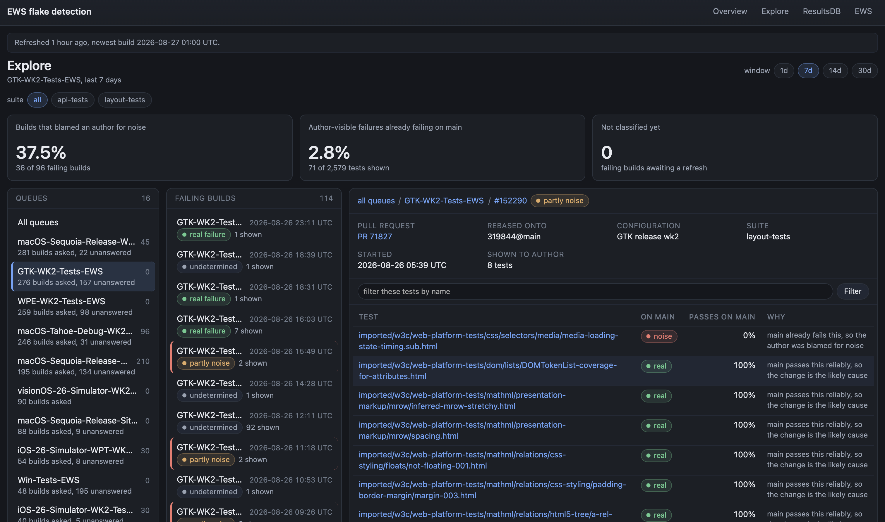

# EWS Flake Dashboard

Does EWS's flake detection stop authors being blamed for failures that were not theirs?

EWS records every test failure and flake it sees to results.webkit.org, then consults that history
before blaming a change. This dashboard measures whether that helps. It answers one question on the
front page — what share of failing builds showed an author a failure that main already fails — and
links out to results.webkit.org and EWS for everything else, because both already render this data
better than a second copy would.



Behind the front page, Explore holds two panes side by side — the failing builds in the queues picked from the header dropdown, then one build's author-visible failures with what main says about each and why that verdict was reached. Every filter is a link, so any view is a URL you can send someone. A legend at the foot of the page glosses every build-state chip with a live count and a link back to the pane narrowed to it where one is honestly obtainable from the same scoped query the pane above already ran; the test-verdict table beside it carries no count column.

The queue dropdown in every page's header is four levels deep: platform family, then queue group, then OS version where a version actually divides the group, then the individual builder. Apple holds macOS, iOS and visionOS; Linux holds GTK and WPE; Windows and the leftover `other` bucket are each their own family, so every group sits under exactly one — a family holding a single group of its own name draws one row rather than repeating itself. Each level is an independent, repeatable query argument, and a tick submits only its own value: `?family=Apple`, `?group=macOS`, `?version=macOS:Sequoia`, `?builder=macOS-Sequoia-Release-WK2-Tests-EWS`, unioned when several are given. A version is group-qualified so `version=iOS:26` cannot also reach the visionOS 26 simulator. Selecting a parent covers whatever it contains later too, which enumerating today's builders would not, so the query stays short and stays true; a family, group or version name the page cannot read is ignored and named on the page rather than refusing the request. Beside each parent is the convictions its own subtree holds, summed from the same builder counts. A selected parent renders its descendants ticked and marked as inherited rather than set by hand — tinted with an accent bar down the left — so a page arrived at by URL reads the same as one arrived at by clicking, and those inherited boxes are not submitted, which is what keeps the query from growing.

Tests holds the convicted-test table: one row per test, with every flake type it was convicted under, how many times, on how many queues, and when it was last seen. Clicking a test opens a drilldown beside the table listing every conviction of that one test — its build, queue, flake type and when. The table is filtered and ordered by two repeatable query arguments, which the *Filter and sort* disclosure in its header writes for you: `f.tests=<column>:<condition>:<value>` and `s.tests=<column>:<asc|desc>`. Both are read in the order they are written, so two filters both apply and two sorts are a primary and a secondary key — `?f.tests=test:has:editing&f.tests=convictions:ge:3&s.tests=last_seen:desc&s.tests=test:asc`. The columns and the conditions each one takes are listed in the disclosure and defined in `analysis/filters.py`, which is the only place a request can name a column at all; a clause it cannot read is ignored and named on the page rather than refusing the request, since a URL is the whole of this page's state. Inside the disclosure each clause is one row of its own, stacked downwards rather than flowing sideways, and every row carries its own `×`, applied or not. A row whose clause is already in the query removes itself with a plain link to this same page minus that one clause, so removing the second of three leaves the first and third in the order they were written; a row only just added with “+ filter” is in no URL to subtract from, so its `×` is the mirror of that button — a named submit carrying the row's index, which the server strips before it reads the surface. Neither needs a script, and the two are indistinguishable on screen. A legend at the foot of the page glosses each flake type, with a conviction count for the window and a link to the table narrowed to it.

## Running it

For a fresh database, `scripts/setup.sh` does the install, database creation, test
run and first ingest in one command, and refuses to touch a database that already
exists so it cannot clobber a live one:

```
scripts/setup.sh                            # fresh setup: install, create, test, ingest
scripts/setup.sh --checkout /path/to/WebKit # also print the escape-detection command (see below)
python3 -m flask --app ews_dashboard.web.app:create_app run
```

Or run the same steps by hand:

```
pip3 install -r requirements.txt
python3 -m ews_dashboard.db                 # create the database
python3 -m scripts.refresh                  # ingest builds and classify them (slow, needs network)
python3 -m flask --app ews_dashboard.web.app:create_app run
```

No credentials of any kind. Both APIs it reads are public and it only ever issues GETs, so there is
nothing to configure and nothing to leak. `EWS_DASHBOARD_DATABASE` overrides where the sqlite file
lives.

`scripts/refresh.py` is the only thing that touches the network. It defaults to the widest window the pages offer, 90 days, so a verdict exists for everything a reader can ask to see; `--days` narrows it. The web app reads the database and nothing else, which is why a page cannot hang on a slow results.webkit.org query and why every page shows how old its numbers are.

The escapes page ("What main said afterwards", below) stays empty until escape
detection runs, and escape detection is skipped on every refresh unless
`EWS_DASHBOARD_CHECKOUT` points at a WebKit checkout — the plain setup above does
not enable it. There is no default checkout on purpose: a wrong path reads as
thousands of pull requests that never landed. The pass is also slow (serial
`results.webkit.org` queries, on the order of 20 minutes) and should be run
detached with a log file, never inline. `scripts/setup.sh --checkout PATH` prints
the exact command for it rather than running it:

```
EWS_DASHBOARD_CHECKOUT=/path/to/WebKit \
  nohup python3 -u -m scripts.refresh --skip-ingest --days 90 > escape-refresh.log 2>&1 &
```

## How the metric is defined

A build's author-visible failures are the tests that failed in both the first run and the rerun and
did not fail on a clean tree — the set behind "Found N new test failures". Each is looked up on main
at the commit the change was rebased onto:

- **pre-existing** — main passes it 80% of the time or less, so the change is not the cause
- **real** — main passes it reliably, so the change is the likely cause
- **undetermined** — nothing recorded for that test in that configuration

Every rate on the pages is a floor, not a verdict. Main does not contain the change, so a test that
is reliable on main and genuinely broken by the change looks identical to one that flaked once during
this build. Read a trend, not a single build.

The filtered failure lists EWS publishes — `first_run_failures_filtered` and `second_run_failures_filtered`, which hold what the author was actually shown — only exist on builds from after the EWS deployments `config.py` dates: 2026-08-14 for the write path and 2026-08-25 for the read path, the first build carrying a results-db flakiness property. A layout-test build from before those dates carries neither, because the same step sets the filtered lists and the flakiness properties together, so any window reaching back past them mixes two schemes — `ingest.py` prefers the filtered lists per build and falls back to the raw ones.

## What main said afterwards

A conviction is a failure this dashboard excused as pre-existing. Once its pull request has landed, `analysis/escapes.py` asks main whether that excuse held, over one window either side of the landing and in the same configuration, and stores one verdict per conviction: **ESCAPED** (main never failed the test before the landing and failed it after), **FAILS_ON_MAIN** (main was already failing it, at any rate at all, and failed it after too), **CONTAINED** (main ran it after the landing and never failed it), **NO_RUNS**, **NO_BASELINE** and **TREE_DIVERGED** for the convictions main answered nothing about.

The page lists five buckets, not six: ESCAPED and FAILS_ON_MAIN are shown as one. Both answer the same question — main failed the test after the landing — and only the baseline separated them, on a single failure. That knife-edge sorted severity wrongly: a test main had failed once in a hundred runs before the landing and then 88 of 125 runs after it was filed under FAILS_ON_MAIN and went unread, while an escape resting on one failure in fifty runs led the page as ESCAPED. So the baseline question is kept as a split under the merged bucket — main *was not failing it* before the landing, or *was already failing it* — rather than as two buckets. Nothing about the fold is stored: the verdict on a row is still the raw observation the assess pass wrote, both names stay in the listing's filter vocabulary, so `f.escapes=verdict:eq:FAILS_ON_MAIN` returns exactly that half, and reverting the fold is an edit to `MERGED_ESCAPE_VERDICTS` rather than a migration.

Beside the merged bucket's conviction count the page prints how many **distinct tests** those convictions name, because the two numbers are far apart and only the second is a count of regressions. One landed regression makes a fresh conviction on every later pull request whose build trips the same test — one local measurement had 29 convictions on a single `css-cascade` test, its `failed_before` climbing 1, 2, 3, 4, 7, 8, 11, 19, 20 as it poisoned each later baseline — so the conviction count is a count of blame events and not of underlying breakages.

How hard an escape failed is one figure, not a threshold. The escapes table shows **rate increase**, the lower end of a one-sided interval on the change in failure rate either side of the landing, computed by Newcombe's square-and-add method from the two count pairs already stored. Above zero means the rate rose by more than the evidence explains by chance at `ESCAPE_SIGNIFICANCE_ALPHA`, and the page labels such a conviction **STRONG**; at or below zero it is **UNPROVEN**, which is not the same as no failures — main did fail the test after the landing, but nothing shows the landing raised the rate. Both are rendered as uppercase constants, like the verdict names beside them, and `STRONG` no longer means what the threshold it replaced meant: it is a bound clearing zero, not a share of the runs after the landing failing. The internal names are `rate_increase_for_counts` and `significance_for_counts`; no `STRONG`/`RARE` constant exists. This replaced a flat 50%-of-the-runs threshold that ignored both the sample size and the baseline: it called an escape strong on 7 of 144 tests while filing 52 tests whose worsening was real under "rests on few failures", among them a test that never failed in 94 runs before the landing and then failed 56 of 127 after it.

Whether main is *still* failing the test is a separate question, asked over a fresh `CURRENCY_DAYS` window and re-asked once a day. It has four answers, not two: still failing, recovered, not run lately when main ran the test no times in the window, and unchecked when nothing has asked yet — the last two are absences of evidence, and neither of them is a recovery. The escapes table shows this as current damage, the raw `recent_failed / recent_runs` from that check, blank rather than zero when nothing has asked or main ran nothing about it. The assess pass only ever asked the clean-baseline half, so today the already-failing half of the merged bucket reads as unchecked — truthfully, since nobody has asked it. Which of the four a row is in is read off the damage cell rather than said in words; the two absences both render blank there, and the split beside the table is where they are counted apart.

A row of the listing answers in figures, not in prose. In the merged escape bucket it carries three count pairs in three right-aligned cells — **Before** (`failed_before/runs_before`, the baseline), **Rate increase** (the bound, with `failed_after/runs_after` under it) and **Current damage** (the rate, with `recent_failed/recent_runs` under it) — and each figure appears once in the row. That replaced a `Why` column of English that said the same things in 21 words a row and 4,359 down a 200-row page: it restated the after pair, restated the recent runs, and restated the sign of the rate increase, leaving only the baseline pair as a fact nothing else on the row carried. The four categories main answered nothing about print an em dash in both numeric cells, so their rows keep that fourth column as a `Why` instead, holding a phrase of at most `escapes.REASON_WORDS` words that says what an em dash cannot: how many runs main did make and never failed (CONTAINED), that it made none after the landing (NO_RUNS) or none before it (NO_BASELINE), or how far the pull request moved from the version convicted (TREE_DIVERGED).

Definitions and caveats are one collapsed **Legend and caveats** block at the foot of the page, not two. They were separate disclosures answering the same question a reader opens either of them with, and `tests/prose_budget_test.py` holds that block, the headline cards, the splits, the open category's description and the widest cell of the fourth column to word ceilings measured on the rendered page. A budget failure there is copy that grew: the fix is to cut words, never to raise the ceiling.

## Layout

```
ews_dashboard/
  schema.sql      tables, views, and the invalidation rule for every cache
  db.py           connections and forward-only migrations
  config.py       thresholds, rule names, and the dated list of EWS deployments
  suites.py       which builders are read, and how each publishes its failure lists
  buildbot.py     EWS's Buildbot API
  results.py      results.webkit.org history, cached, including negative caching
  ingest.py       builds and flakiness verdicts into the database
  analysis/       false_positive, convictions, escapes, filters, trend, freshness
  web/            Flask app, links out, SVG chart geometry, templates
scripts/refresh.py
tests/
```

There is no CDN, no build step and no npm. The chart is server-generated SVG, and
`ews_dashboard/web/static/dashboard.css` is the whole stylesheet, so the pages render from a
checkout with no network. `ews_dashboard/web/static/dashboard.js` is the one script, a plain file
with no framework that enhances the tests page's filter/sort chips and the queue picker's checkbox
tree — ticking a family, group or version there also ticks what it contains on screen, and narrows the
submitted query to that parent's own value rather than every builder it happens to contain today;
every page works the same, one request per click, with it blocked. The server renders the same
inherited ticks on load, so the two paths agree. On the chip form the script also applies a clause as
soon as it is whole, so Apply is usually not needed — on `change` only, never on each keystroke, and
never on a clause still being built (a column with no value yet, or the first element of a list). Apply
stays where it is, and with the script blocked it is what applies a clause.

Known gaps and planned work are tracked in [`docs/open-work.md`](docs/open-work.md), not an issue
tracker, so a reader looking at the code can see in one place what is not done yet and why.
